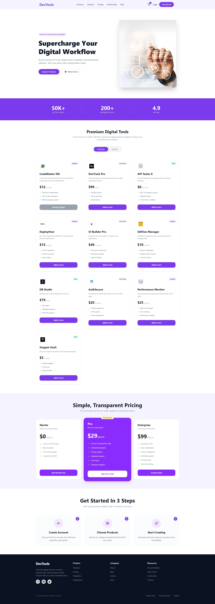

# 🛠️ DevTools — Premium Digital Workflow Platform

---

## 📌 About The Project

**DevTools** is a modern, fully responsive premium digital tools marketplace built with React.js. Users can browse a curated collection of developer productivity tools, add them to a cart, and explore pricing plans — all in one sleek, fast-loading interface.

This project was built as an assignment to demonstrate proficiency in React component architecture, state management, dynamic UI rendering from JSON data, and third-party package integration.

---

## ✨ Key Features

### 🛒 Dynamic Shopping Cart with Real-time Updates
Add or remove products from the cart with instant UI feedback. The navbar cart icon updates live with the current item count, and toast notifications (via **React-Toastify**) confirm every action — add, remove, or checkout.

### 🔀 Product / Cart Toggle View
A clean dual-button toggle lets users seamlessly switch between the **Products** grid and their **Cart** — no page reloads, no confusion. The cart shows a friendly empty state when nothing has been added yet.

### 📱 Fully Responsive Design
The entire layout — from the hero banner and 3-column product grid to pricing cards and footer — is built with a **mobile-first** approach using Tailwind CSS, ensuring a polished experience on all screen sizes.

---

## 🧰 Technologies Used

| Technology | Purpose |
|---|---|
| **React.js** | Component-based UI architecture & state management |
| **Tailwind CSS** | Utility-first responsive styling |
| **JavaScript (ES6+)** | Logic, array methods, find and filter methods |
| **React-Toastify** | Toast notifications for cart interactions |
| **JSON** | Local product data source |

---

🌐 **Live Demo:** [Live Site Link](https://devtools-puce.vercel.app/)
📂 **Repository:** [GitHub Repository Link](https://github.com/ziaulhoquepatwary/Dev-Tools.git)